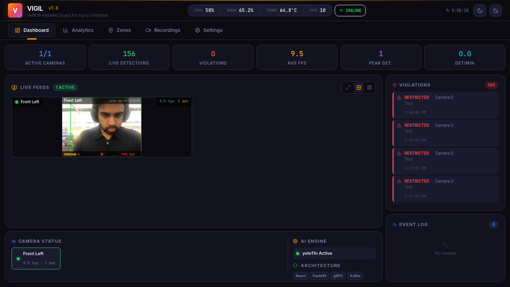
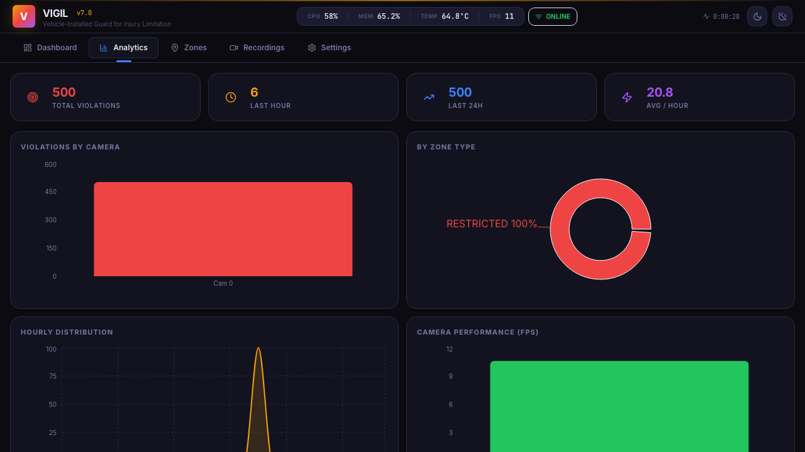
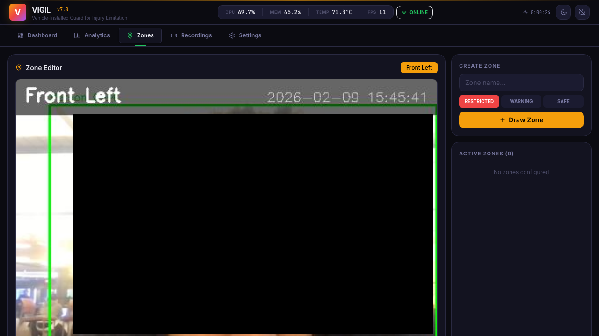
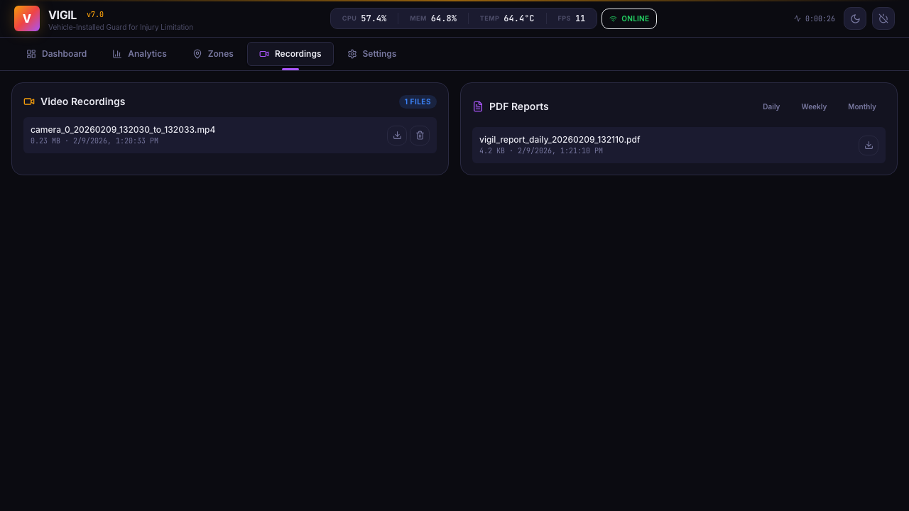
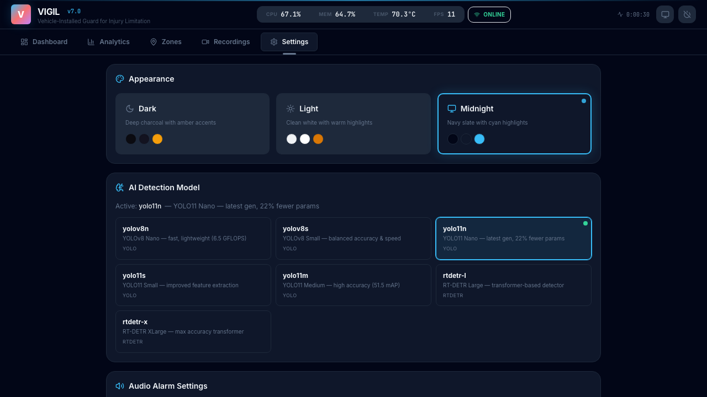

<div align="center">

# VIGIL

### Vehicle-Installed Guard for Injury Limitation

**Real-time AI pedestrian detection for industrial forklifts**


</div>

---

## Screenshots

### Dashboard
Real-time command center with live camera feeds, KPI ribbon, violation ticker, and system status.



### Analytics
Violation charts by camera, zone type distribution, hourly trends, and camera FPS performance.



### Zone Editor
Draw restricted, warning, and safe zones directly on camera feeds with live preview.



### Recordings & Reports
Video recording management and PDF report generation (daily, weekly, monthly).



### Settings — AI Model Selector & Themes
Hot-swap between 7 AI models at runtime. Choose from Dark, Light, or Midnight themes.


### Settings — Detection & System
Barrier detection, tamper detection, audio alarm configuration, and system information.



---

## Overview

VIGIL is a production-grade AI-powered safety system that mounts on warehouse forklifts to detect pedestrians in real time. It ships with **7 swappable AI models** — from lightweight YOLO11 Nano to high-accuracy RT-DETR transformers — and pairs them with a modern React command-center dashboard, gRPC streaming, and optional Kafka event pipelines.

**Key capabilities:**

| Capability | Details |
|---|---|
| **Multi-Model AI** | 7 detection models (YOLO11n/s/m, YOLOv8n/s, RT-DETR L/X) — hot-swap at runtime |
| **Multi-Camera Detection** | Up to 4 simultaneous camera feeds with real-time inference |
| **Zone Enforcement** | Draw restricted / warning / safe zones directly on camera feeds |
| **Barrier Recognition** | Detects red/yellow industrial safety barriers, filters false positives |
| **Tamper Detection** | Alerts on camera blocking, covering, or disconnection |
| **Event Pipeline** | gRPC bi-directional streaming + optional Kafka topic publishing |
| **Theming** | 3 built-in themes (Dark, Light, Midnight) with localStorage persistence |
| **Recordings & Reports** | Per-camera video recording, PDF report generation, violation export |

---

## Architecture

```
┌─────────────────────────────────────────────────────────┐
│                    Browser (React SPA)                    │
│  ┌──────────┐ ┌──────────┐ ┌──────────┐ ┌────────────┐ │
│  │Dashboard │ │Analytics │ │Recordings│ │  Settings  │ │
│  │  + KPIs  │ │ + Charts │ │ + Zones  │ │  + Themes  │ │
│  └────┬─────┘ └────┬─────┘ └────┬─────┘ └─────┬──────┘ │
│       └─────────────┴────────────┴─────────────┘        │
│                         REST / SSE                       │
└─────────────────────────┬───────────────────────────────┘
                          │  HTTP :8000
┌─────────────────────────┴───────────────────────────────┐
│                    FastAPI Backend                        │
│  ┌────────────┐ ┌──────────────┐ ┌───────────────────┐  │
│  │  Camera    │ │   YOLOv8n    │ │  Zone / Violation  │  │
│  │  Manager   │ │   Detector   │ │     Engine         │  │
│  └────┬───────┘ └──────┬───────┘ └────────┬──────────┘  │
│       │                │                   │             │
│  ┌────┴────────────────┴───────────────────┴──────────┐  │
│  │              Detection Pipeline                     │  │
│  │  frame → detect → zone check → alert → record      │  │
│  └────────────┬──────────────────────┬────────────────┘  │
│               │                      │                   │
│        ┌──────┴───────┐     ┌────────┴────────┐         │
│        │  gRPC Server │     │  Kafka Producer  │         │
│        │   :50051     │     │  (optional)      │         │
│        └──────────────┘     └─────────────────┘         │
└─────────────────────────────────────────────────────────┘
```

---

## Tech Stack

| Layer | Technology | Purpose |
|-------|-----------|---------|
| **Frontend** | React 18, TypeScript, Vite | Single-page command-center UI |
| **Styling** | Tailwind CSS 3.4, CSS Variables | Theme-driven responsive design |
| **State** | Zustand 5 + persist middleware | Client state + theme persistence |
| **Charts** | Recharts | Analytics & time-series visualization |
| **Backend** | FastAPI + Uvicorn | REST API, MJPEG streaming, static serving |
| **Detection** | YOLO11 / YOLOv8 / RT-DETR (Ultralytics) | Multi-model person + object inference, hot-swappable |
| **Vision** | OpenCV 4 | Frame capture, MJPEG encoding, recording |
| **RPC** | gRPC + Protocol Buffers | Bi-directional streaming, service definitions |
| **Events** | Apache Kafka | Async event pipeline (5 topics) |
| **Reports** | ReportLab | PDF report generation |

---

## Quick Start

### Prerequisites

- Python 3.11+
- Node.js 18+ and npm (for frontend development only)
- USB camera or built-in webcam

### 1. Clone & Install

```bash
git clone <your-repo-url> && cd VIGIL

# Python dependencies
pip install -r requirements.txt

# Or install manually:
pip install fastapi uvicorn pydantic opencv-python numpy ultralytics \
            reportlab psutil grpcio grpcio-tools kafka-python
```

### 2. Build the Frontend (optional — pre-built `static/` is included)

```bash
cd frontend
npm install
npm run build   # outputs to ../static/
cd ..
```

### 3. Generate gRPC Stubs (optional — pre-generated stubs included)

```bash
python -m grpc_tools.protoc -I. --python_out=./services/generated \
  --grpc_python_out=./services/generated proto/vigil.proto
```

### 4. Run

```bash
python VIGIL.py
```

Open **http://localhost:8000** in your browser.

> **Kafka is optional.** If no broker is reachable at `localhost:9092`, VIGIL logs a notice and runs without it. To enable Kafka, start a broker via Docker:
> ```bash
> docker-compose up -d
> ```

---

## Features

### Dashboard

The command-center dashboard provides a single-pane view of all system activity:

- **KPI Ribbon** — 6 live metrics (cameras, detections, violations, zone alerts, FPS, uptime)
- **Camera Grid** — 1×1, 2×2, or picture-in-picture layouts with real-time MJPEG feeds
- **HUD Overlays** — Per-camera FPS, detection count, and status indicators
- **Violation Ticker** — Color-coded live feed of safety events
- **Event Log** — Timestamped system activity log

### Detection Engine

| Feature | Description |
|---------|-------------|
| **Multi-Model AI** | 7 models with runtime hot-swap — see table below |
| **Person Detection** | Configurable confidence thresholds, runs on CPU or GPU |
| **Barrier Detection** | HSV color-space analysis for red/yellow industrial barriers |
| **Behind-Barrier Filtering** | Suppresses false positives when a person is behind a detected barrier |
| **Zone Enforcement** | Polygon zones drawn on camera feeds — restricted (red), warning (yellow), safe (green) |
| **Tamper Detection** | Darkness analysis detects camera blocking; heartbeat detects disconnection |

#### Supported AI Models

Switch models at runtime from **Settings → AI Detection Model** or via `POST /api/ai/models/switch`.

| Model | Family | Description | Use Case |
|-------|--------|-------------|----------|
| **yolo11n** *(default)* | YOLO | YOLO11 Nano — 22% fewer params than v8 | Best balance of speed & accuracy |
| **yolo11s** | YOLO | YOLO11 Small — improved feature extraction | Higher accuracy, still fast |
| **yolo11m** | YOLO | YOLO11 Medium — 51.5 mAP | Maximum YOLO accuracy |
| **yolov8n** | YOLO | YOLOv8 Nano — 6.5 GFLOPS | Ultra-lightweight, legacy compat |
| **yolov8s** | YOLO | YOLOv8 Small — balanced | Moderate resource environments |
| **rtdetr-l** | RT-DETR | RT-DETR Large — transformer-based | High accuracy, GPU recommended |
| **rtdetr-x** | RT-DETR | RT-DETR XLarge — max accuracy | Best accuracy, requires GPU |

Model weights are auto-downloaded on first use. The `DetectionEngine` class handles thread-safe loading with zero-downtime swaps.

### Analytics

- Hourly detection and violation charts (area + bar)
- Camera-level detection distribution (pie)
- Zone violation heatmap data
- Report generation (daily / weekly / monthly PDF)

### Themes

Three built-in themes, switchable from the header or Settings page:

| Theme | Description |
|-------|-------------|
| **Dark** | Deep charcoal (#0b0b11) with warm amber accents |
| **Light** | Clean white (#f0f2f5) with subtle warm highlights |
| **Midnight** | Navy-slate (#020617) with cool cyan accents |

Theme preference persists across sessions via `localStorage`.

### gRPC Services

Defined in `proto/vigil.proto`:

| Service | Methods | Description |
|---------|---------|-------------|
| `VIGILDetection` | `StreamDetections`, `GetDetectionSnapshot` | Real-time detection streaming |
| `VIGILCamera` | `ListCameras`, `GetCameraStream`, `ControlCamera` | Camera management |
| `VIGILZone` | `GetZones`, `CreateZone`, `DeleteZone` | Zone CRUD |
| `VIGILAlert` | `StreamAlerts`, `AcknowledgeAlert` | Alert management |

### Kafka Topics

| Topic | Description |
|-------|-------------|
| `vigil.detections` | Raw detection events |
| `vigil.violations` | Zone violation events |
| `vigil.alerts` | Critical alert events |
| `vigil.system` | System health metrics |
| `vigil.recordings` | Recording start/stop events |

---

## API Reference

### Camera & Streaming

| Endpoint | Method | Description |
|----------|--------|-------------|
| `/api/cameras` | GET | List all cameras with status |
| `/api/camera/{id}/stream` | GET | MJPEG video stream |
| `/api/camera/{id}/start` | POST | Start camera |
| `/api/camera/{id}/stop` | POST | Stop camera |
| `/api/camera/{id}/detection` | POST | Toggle detection on/off |
| `/api/camera/{id}/record/start` | POST | Start recording |
| `/api/camera/{id}/record/stop` | POST | Stop recording |

### Zones

| Endpoint | Method | Description |
|----------|--------|-------------|
| `/api/camera/{id}/zones` | GET | Get zones for a camera |
| `/api/camera/{id}/zones` | POST | Create / update zones |
| `/api/zones/all` | GET | Get zones for all cameras |

### Violations & Events

| Endpoint | Method | Description |
|----------|--------|-------------|
| `/api/violations` | GET | Violation history (with pagination) |
| `/api/violations/export` | GET | Export violations as JSON/CSV |
| `/api/events` | GET | System event log |

### Analytics & Reports

| Endpoint | Method | Description |
|----------|--------|-------------|
| `/api/system/stats` | GET | System statistics (CPU, memory, FPS) |
| `/api/reports/generate` | GET | Generate PDF report |
| `/api/recordings` | GET | List recordings |

### AI Models

| Endpoint | Method | Description |
|----------|--------|-------------|
| `/api/ai/models` | GET | List all supported models + active model |
| `/api/ai/models/switch` | POST | Switch AI model at runtime (`{"model_id": "yolo11n"}`) |

### Settings

| Endpoint | Method | Description |
|----------|--------|-------------|
| `/api/audio/settings` | GET/POST | Audio alarm configuration |
| `/api/audio/test` | POST | Test audio alarm |
| `/api/barrier/settings` | GET/POST | Barrier detection settings |
| `/api/tamper/status` | GET | Tamper detection status |
| `/api/tamper/settings` | POST | Update tamper settings |

---

## Project Structure

```
VIGIL/
├── VIGIL.py                        # Main backend (FastAPI + detection pipeline)
├── requirements.txt                # Python dependencies
├── docker-compose.yml              # Kafka + Zookeeper setup
├── setup.sh                        # One-click setup script
│
├── frontend/                       # React SPA
│   ├── package.json
│   ├── vite.config.ts              # Vite config (builds to ../static/)
│   ├── tailwind.config.js          # CSS variable-driven theme config
│   ├── index.html                  # HTML shell (Inter + JetBrains Mono fonts)
│   └── src/
│       ├── App.tsx                 # Root component
│       ├── index.css               # Theme definitions (dark/light/midnight)
│       ├── stores/
│       │   ├── vigilStore.ts       # Main application state (Zustand)
│       │   └── themeStore.ts       # Theme state + localStorage persistence
│       ├── lib/
│       │   ├── api.ts              # REST API client
│       │   └── audioEngine.ts      # Web Audio API alarm engine
│       └── components/
│           ├── Header.tsx          # Top bar with vitals + theme toggle
│           ├── TabNav.tsx          # Color-coded tab navigation
│           ├── DashboardView.tsx   # KPI ribbon + camera grid + events
│           ├── StatsPanel.tsx      # Horizontal system stats bar
│           ├── CameraGrid.tsx      # Camera grid with layout controls
│           ├── CameraFeed.tsx      # Individual camera with HUD overlay
│           ├── ViolationTicker.tsx  # Live violation feed
│           ├── EventLog.tsx        # System event log
│           ├── AnalyticsView.tsx   # Charts + KPIs + report generation
│           ├── ZoneManagement.tsx  # Zone drawing interface
│           ├── RecordingsView.tsx  # Recording playback + download
│           └── SettingsView.tsx    # System settings + theme selector
│
├── proto/
│   └── vigil.proto                 # gRPC service definitions
│
├── services/
│   ├── grpc_server.py              # gRPC server implementation
│   ├── kafka_events.py             # Kafka producer/consumer
│   └── generated/                  # Auto-generated protobuf stubs
│       ├── vigil_pb2.py
│       └── vigil_pb2_grpc.py
│
├── static/                         # Built React frontend (served by FastAPI)
├── recordings/                     # Camera recordings (.avi)
├── reports/                        # Generated PDF reports
├── zones.json                      # Persisted zone configurations
├── violations.json                 # Violation history
└── *.pt                            # AI model weights (auto-downloaded)
```

---

## Configuration

### Email Alerts

```python
# In VIGIL.py
EMAIL_CONFIG = {
    'enabled': True,
    'smtp_server': 'smtp.gmail.com',
    'smtp_port': 587,
    'sender_email': 'your-email@gmail.com',
    'sender_password': 'your-app-password',
    'recipient_emails': ['safety-team@example.com']
}
```

### Barrier Detection

Tune via the Settings UI or in `VIGIL.py`:

```python
barrier_settings = {
    'enabled': True,
    'min_area': 5000,
    'max_area': 500000,
    'min_width': 50,
    'min_height': 50,
    'min_saturation': 150,
}
```

### Kafka Broker

By default VIGIL connects to `localhost:9092`. Override in `services/kafka_events.py` or use the included `docker-compose.yml`:

```bash
docker-compose up -d   # Starts Zookeeper + Kafka
```

---

## Troubleshooting

| Problem | Solution |
|---------|----------|
| Port 8000 in use | `lsof -ti:8000 \| xargs kill -9` then restart |
| NumPy 2.x warnings | `pip install "numpy<2"` |
| No cameras detected | Check USB connections; grant camera permissions (macOS: System Settings → Privacy & Security → Camera) |
| Kafka connection refused | Expected if no broker running — VIGIL runs fine without it |
| gRPC import error | Regenerate stubs: `python -m grpc_tools.protoc -I. --python_out=./services/generated --grpc_python_out=./services/generated proto/vigil.proto` |
| Frontend build fails | `cd frontend && rm -rf node_modules && npm install && npm run build` |

---

## Development

### Frontend Dev Server (with hot reload)

```bash
cd frontend
npm run dev   # Runs on port 5173, proxies API to :8000
```

### Useful Commands

```bash
# Lint check
cd frontend && npx tsc --noEmit

# Production build
cd frontend && npm run build

# Generate gRPC stubs
python -m grpc_tools.protoc -I. --python_out=./services/generated \
  --grpc_python_out=./services/generated proto/vigil.proto
```

---

## License

MIT License — use and modify freely.

---

<div align="center">
<strong>VIGIL</strong> — Vehicle-Installed Guard for Injury Limitation
</div>
